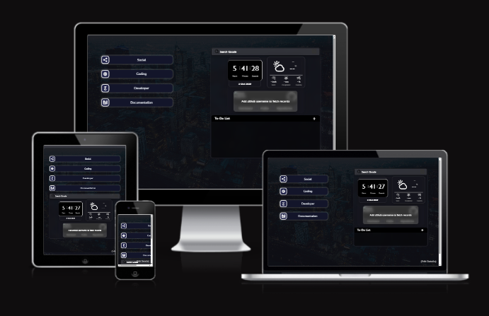

# **Personalized Startpage**

**Personalized Startpage** is a custom-built, lightweight, and efficient browser startpage designed to streamline your daily workflow. It moves beyond standard browser homepages by offering a centralized hub for your favorite links, real-time weather, GitHub statistics, and an integrated To-Do list, all within a sleek, modern, and single-viewport design. It is the perfect blend of utility and aesthetics to enhance your browsing experience.

<div align="center">
  <a href="https://start-page-brown.vercel.app">
    
  </a>
  
  
  
  
</div>

## ✨ Features

### 💻 Productivity Hub
The startpage is built to keep your focus sharp and reduce context switching.
- **Personalized Links:** Quick access to your most frequently visited sites, organized into intuitive categories (e.g., Social, Coding, Developer, Documentation).
- **Integrated To-Do List:** An inline task manager where you can create, edit, and delete tasks to stay organized.
- **Google Custom Search:** Direct web search functionality embedded at the center of the page.
- **Single-Viewport Design:** Optimized CSS ensures a scroll-free experience, fitting all essential information perfectly within the screen.

### 📊 Real-Time Data Widgets
Essential information, updated live, right at your fingertips.
- **Time and Weather:** Displays current time and local weather (temperature, humidity, wind speed, and relevant visual icons).
- **GitHub Stats:** Fetch and display real-time GitHub profile statistics, including followers, following, and repositories.

---

## 🛠️ Technologies Used
The project is built using foundational web technologies and leverages modern APIs for data fetching.

- **HTML:** Provides the core structural foundation for the website.
- **CSS:** Used for styling, implementing the modern glassmorphism effect, and the single-viewport layout.
- **JavaScript:** Handles all dynamic content, API interactions, and user interactions (e.g., To-Do list logic).
- **GitHub API:** For fetching and displaying GitHub user data.
- **Google Search API:** For integrating custom Google search functionality.
- **Weather API:** For obtaining accurate, real-time meteorological data of the specified location.

---
## **Installation:**

1. **Clone the repository:**
   ```bash
   git clone https://github.com/navjot369/StartPage
   ```
2. **Install dependencies:**
   ```bash
   npm install
   ```
3. **Run the development server (temporary):**
   ```bash
   npm run dev
   ```
   **Run the server(local) continuously, even after closing the terminal:**
   ```bash
   npm run start
   ```
5. **Access the startpage:** Open your browser and navigate to `http://localhost:3000`.
   

## **Customization:**

* **Links:** Edit the `data.js` file to add, remove, or modify links.
* **GitHub Stats:** Replace the placeholder values in the code with your GitHub username.
* **Location:** Replace the coordinates in fetch API with present location.

## **Technologies:**

* **HTML:** Provides the structure for website.
* **CSS:** For styling the components.
* **JavaScript:** For handling interactions and data.
* **GitHub API:** For fetching GitHub user data.
* **Google Search API:** For integrating Google search functionality.
* **Weather API:** For fetching real-time weather stats of location specified.

## 📲 Check Responsive 📲

```StartPage``` is designed with a mobile-first approach, ensuring usability across all devices. Click the image below to check its responsive design.

<div align="center">
  <a href="https://ui.dev/amiresponsive?url=https://start-page-brown.vercel.app" target="_blank">
    
  </a>
</div>

<br><br>


## Contributing

We welcome contributions to StartPage! If you have suggestions, bug reports, or improvements, please open an issue or submit a pull request. Make sure to follow the contribution guidelines.

### Hacktoberfest 2025 Contribution Steps

If you want to participate in Hacktoberfest 2025 and contribute to this project, please follow these steps:

1. **Register for Hacktoberfest**  
   Sign up at [hacktoberfest.com](https://hacktoberfest.com) to connect your GitHub account and track your contributions.

2. **Find Issues to Work On**  
   Look for issues in this repository labeled with `hacktoberfest` or `good first issue` as they are good starting points.

3. **Fork and Clone the Repository**  
   Fork this repo to your GitHub account and clone it to your local machine.

4. **Create a New Branch**  
   Make a new branch for your changes to keep your work organized.

5. **Make Your Contributions**  
   Improve documentation, fix bugs, add features, or improve tests as per the issue or your ideas.

6. **Submit a Pull Request (PR)**  
   Push your changes to your fork and open a PR against the main repository’s main branch.  
   - Follow the project’s contribution guidelines.  
   - Include clear descriptions and link to related issues if applicable.

7. **Get Your PR Reviewed**  
   Respond promptly to any feedback from maintainers and make required revisions.

8. **Ensure Your PR is Accepted or Labeled**  
   For your PR to count towards Hacktoberfest, maintainers must merge it or label it with `hacktoberfest-accepted`.

9. **Complete the Challenge**  
   Submit 6 valid and accepted PRs between October 1 and October 31 to earn your Hacktoberfest rewards.

Happy contributing and thank you for supporting open source!


## License
This project is licensed under the MIT License. See the [LICENSE](LICENSE) file for details.

<div>
  <h2>🙌 Our Amazing Contributors 🙌</h2>
  <a href="https://github.com/repo=navjot369/StartPage/graphs/contributors" align="center">
  
</a>
</div>
<br><br>
<div align="center">
  
  <h3 align="left">Maintained By - Navjot Singh <br>(https://github.com/navjot369)</h3>
</div>

